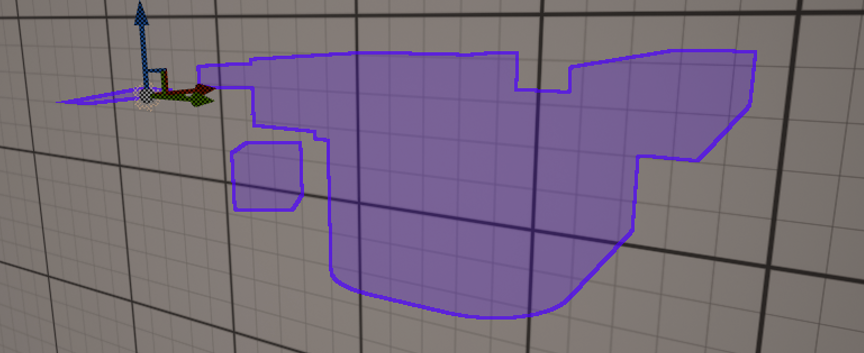

# GonzoFX Deep Dive
{: .fs-9 .fw-700 }
[Home](https://madteapartygames.github.io/the-gonzo-docs/){: .btn .btn-purple }
[Quick Start](https://madteapartygames.github.io/the-gonzo-docs/docs/quickstart.html){: .btn .btn-purple }
[Recommends](https://madteapartygames.github.io/the-gonzo-docs/docs/recommends.html){: .btn .btn-purple }
### Yesterday's weirdness is tomorrow's reason why.
{: .fs-4 }

## A Deeper Look Into the GonzoFX Actor:
{: .fs-7 .fw-700 }

### From the Core: 
{: .fs-5 .fw-700 }

> - **Gameplay Tags**
>
> GonzoFX utilizes Gameplay Tags to drive the main settings, and which effects it should apply. The Gameplay Tags utilized by GonzoFX are Native Gameplay Tags. Since they are all setup natively in C++, they will just showup in your project settings without needing to load any data tables or .ini's.
> 
> 
> 
> The main GonzoFX control setting tags are:
> > 1. **Gonzo.AlwaysOn** - This is enabled by default. When enabled, GonzoFX will use a looping timer to check for tag and setting changes.
> > 1. **Gonzo.Debug** - This is disabled by default. When enabled, GonzoFX will display various messages when functions are run, and effects applied.
> > 1. **Gonzo.Enabled** - This is enabled by default. With this tag, GonzoFX can be easily turned _on_ and _off_.
> > 1. **Gonzo.Unbound** - This is enabled by default. When enabled, GonzoFX post process effects will not be bound by the bounding box that is native to the actor. When disabled, GonzoFX post process effects will be confined to the limits of the bounding box.
> >
> > 
> >
> The **Gonzo.Effects** tags are what will determine which post process effects to apply.
>
> 
>
> - **Gonzo Update Rate**
>
> 
>
>  GonzoFX utilizes a timer, specifically **FTimerManager::SetTimer**, to have a looping timer that will always be checking for updates. This setting determines how often the **GonzoUpdate** event will execute, to check for any effect and setting changes. The higher the value, the slower the **GonzoUpdate** event will execute. Default value of **0.1** gives as close to tick as needed. This setting will have no impact if **Gonzo.AlwaysOn** has been removed.
>
>This is chosen over using tick to have an always on type of actor as it is designed to have more than one instance running. There is a chance that I might move this all over to its own async task, but with the option of being able to disable the timer and control this manually, the actor is already very performant.
>
> - **Volume Limits**
>
> 
>
> GonzoFX, by default, will have the **Gonzo.Unbound** tag applied, making it a global post process effect. With this tag, this setting will have no impact. If the **Gonzo.Unbound** tag is removed, then this setting will determine the bounding box limits making it a local post process effect when the camera is within the **Volume Limits**.
>
> 
>
> - **Native Post Process**
>
> 
>
> GonzoFX exposes access to the native post process settings via the struct **FPostProcessSettings**. I am not going to detail what each individual setting does, as these are native to the engine, but have been exposed for expanding the capabilities of GonzoFX and allow for further user customization of effects. For more details you can look at the Unreal documentation for **FPostProcessSettings**.
>
>
> - **Gonzo Effects**
>
> 
>
> GonzoFX's main purpose is to provide custom post process effects. These are the individual settings for each effect that can be applied to a GonzoFX actor by applying the corresponding tag from **Gonzo.Effects**. These will be detailed further in the section below.
> 

### Gonzo Effects: 
{: .fs-5 .fw-700 }
> - **Blur**
>
> 
>
> Adding the tag **Gonzo.Effects.Blur** will apply a standard blur effect. It has the following settings available.
>
> 
>
> > 1. **Blur Samples** - This will control how many samples are applied to the blur effect. The higher the value, the blurrier the image will be. 
> > 1. **Blur Amount** - This will control the scale at which the blur is applied to the screen, and is part of the HLSL used for the Blur material. The higher the value, the more the Blur will scale across the screen.  
> 
> - **Custom Depth Outline**
> 
> > 
>
>  Adding the tag **Gonzo.Effects.CustomDepthOutline** will apply a depth outline effect to any actor with **Render CustomDepth Pass** enabled (checked). It has the following settings available.
>
> 
>
> > 1. **Custom Depth Outline Color** - This will control the color of the outline applied to the actors.
> > 1. **Outline Thickness** - This will control how thick the outline edge is. The higher the value the thicker the outline edge. Setting to 0 will remove the outline edge.
> > 1. **Custom Depth Outline Alpha** - This will control the opacity for the outline effect. The higher the value the more intense the effect will be, with it blending into the outline edge.
> > 1. **Custom Depth Outline Xray** - This will control if the effect can be seen even if the actor is obfuscated by another actor (behind walls).
> > 
> > 1. **Custom Depth Outline Speed** - This will control the rate at which the animation will play if **Custom Depth Outline Pulse** is enabled (checked). The higher the value the slower the pulse.
> > 1. **Custom Depth Outline Pulse** - This will control if the pulse animation is played on the custom depth outline material.
>  > 
> > 1. **Custom Depth Outline Max Z** - This will control the max distance the effect will be rendered. The lower the value the closer the limit will be towards the camera.
> 
> - **Distance Fog**
>
> > 
> 
> Adding the tag **Gonzo.Effects.DistFog** will apply a distance fog effect. It has the following settings available.
>
> 
> 
> > 1. **Dist Fog Near Color** - This will control the color of the fog closest to the camera.
> > 1. **Dist Fog Far Color** - This will control the color of the fog farthest from the camera.
> > 1. **Dist Fog Distance** - This will control how close the fog is to the camera. The higher the value the further out the fog will be. 
> > 1. **Dist Fog Sharpness** - This will control the sharpness between the near and far fogs.The lower the value the more the **Dist Fog Far Color** will take over.  
> 
> - **Drugs**
> 
> > 
>
> - **Drunk**
>
> - **Glitch**
>
> - **Gradient Fog**
>
> - **Hue Panner**
>
> - **Invert**
>
> - **Iridescent**
>
> - **Kaleidoscope**
>
> - **Letterbox**
>
> - **Liquify**
>
> - **Party Lights**
>
> - **Pyramid**
>
> - **Radial Blur**
>
> - **Retro**
>
> - **Tiles**
>
> - **World Glitch**
>

### Advanced Effects: 
{: .fs-5 .fw-700 }
