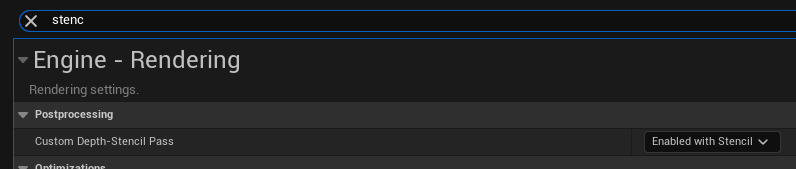

# GonzoFX Quick Start
{: .fs-9 }

> 1. Place a GonzoFX actor into a level
> 1. Default settings will use a timer to always check for Gameplay Tags and setting changes for the various effects.
> 1. Add Gameplay Tags from under **Gonzo.Effects** to apply the effects
> 1. Individual settings can be found under the **Gonzo Effects** section of the GonzoFX actor.

### **Important Information:**

> > - **StencilMask** and **StencilBuffer** settings found under the effect's Advanced Settings requires the project setting **Custom Depth-Stencil Pass** set to **Enabled with Stencil**

{: .fs-6 }
[Home](https://madteapartygames.github.io/the-gonzo-docs/){: .btn .btn-purple }
[The Gonzo Way](https://madteapartygames.github.io/the-gonzo-docs/docs/deepdive.html){: .btn .btn-purple }
[Recommends](https://madteapartygames.github.io/the-gonzo-docs/docs/recommends.html){: .btn .btn-purple }