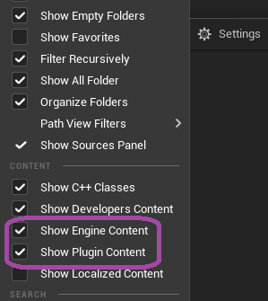

# GonzoFX Quick Start
{: .fs-9 .fw-700 .text-purple-000 }
[Home](https://madteapartygames.github.io/the-gonzo-docs/){: .btn .btn-purple }
[The Gonzo Way](https://madteapartygames.github.io/the-gonzo-docs/docs/deepdive.html){: .btn .btn-purple }
[Recommends](https://madteapartygames.github.io/the-gonzo-docs/docs/recommends.html){: .btn .btn-purple }

## Quick Start Steps:
{: .fs-7 .fw-700 .text-purple-000 }
> - In the Content Browser, enable the setting to show plugin-content
> 
> 
> - Locate the GonzoFX actor in the Content Browser
> 
>  
> - Place a GonzoFX actor into a level
> 
>  
> - Default settings will use a timer to always check for Gameplay Tags and setting changes for the various effects.
> 
>  
> - Add Gameplay Tags from under **Gonzo.Effects** to apply the effects
> 
>  
> - Individual settings can be found under the **Gonzo Effects** section of the GonzoFX actor.
> 
>  

## **Important Information:**
{: .fs-7 .fw-700 .text-yellow-300 }
> - **StencilMask** and **StencilBuffer** settings found under the effect's Advanced Settings requires the project setting **Custom Depth-Stencil Pass** set to **Enabled with Stencil**
> 
> 
> - The timer can be disabled by removing **Gonzo.AlwaysOn** or setting **Gonzo Update Rate** to **0.0**
>
>  
> - If **Gonzo.AlwaysOn** is removed, or **Gonzo Update Rate** set to **0.0**, settings and effects can be manually applied by calling the function **GonzoUpdate**, which is exposed to Blueprint.
> 
> 
> - There are also helper functions exposed to Blueprint for starting and stopping the timer if manual control is desired, or things like temporary effects. These would be **GonzoStart** and **GonzoStop**. If using **GonzoStart**, ensure you add **Gonzo.AlwaysOn** as well as setting **Gonzo Update Rate** to a value greater than **0.0**, like the default of **0.1**
>
> 

