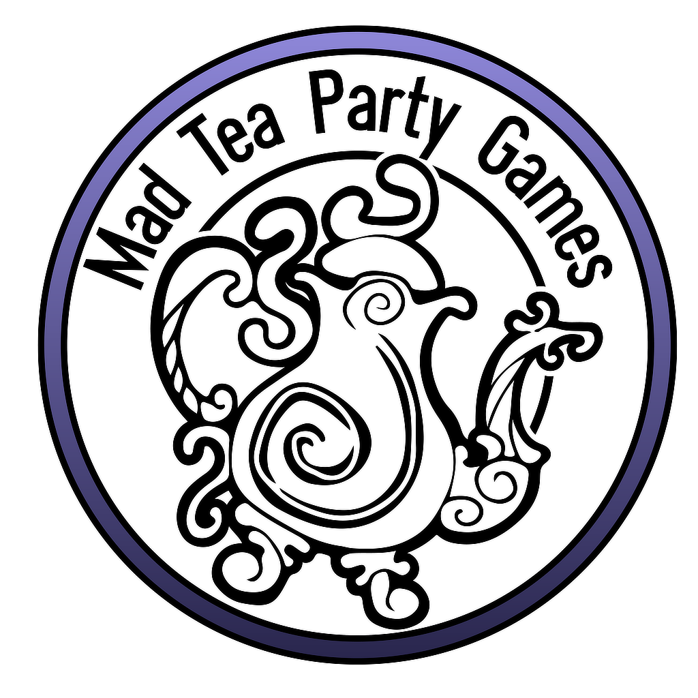

# GonzoFX Plugin Documentation
{: .fs-10 }
### The Edge... there is no honest way to explain it because the only people who really know where it is are the ones who have gone over.
{: .fs-4 }

## Introduction:
{: .fs-6 }

>
> 1. Make a post process actor to apply trippy effects
> 1. ...
> 1. Profit
>

**GonzoFX** ia a plugin that is intended to allow for quick and easy post process effects. Some of them are common effects, others are intended to add some trippy mind altering effects. A single actor built in C++ to be as performant as possible. 

Both the namesake and several of the effects are a direct homage and heavily inspired by my long time love for the life and work of Dr. Hunter S. Thompson. _The **Gonzo** Way_. 

Follow the links below to begin your journey to the edge and back again.

_It never got weird enough for me_.

## Zero to Gonzo in seconds!
{: .fs-6 }
[Quick Start](https://madteapartygames.github.io/the-gonzo-docs/docs/quickstart.html){: .btn .btn-purple }

## Deep dive overview of GonzoFX
{: .fs-6 }
[The Gonzo Way](https://madteapartygames.github.io/the-gonzo-docs/docs/deepdive.html){: .btn .btn-purple }

## Marketplace Recommendations
{: .fs-6 }
[Recommends](https://madteapartygames.github.io/the-gonzo-docs/docs/recommends.html){: .btn .btn-purple }

